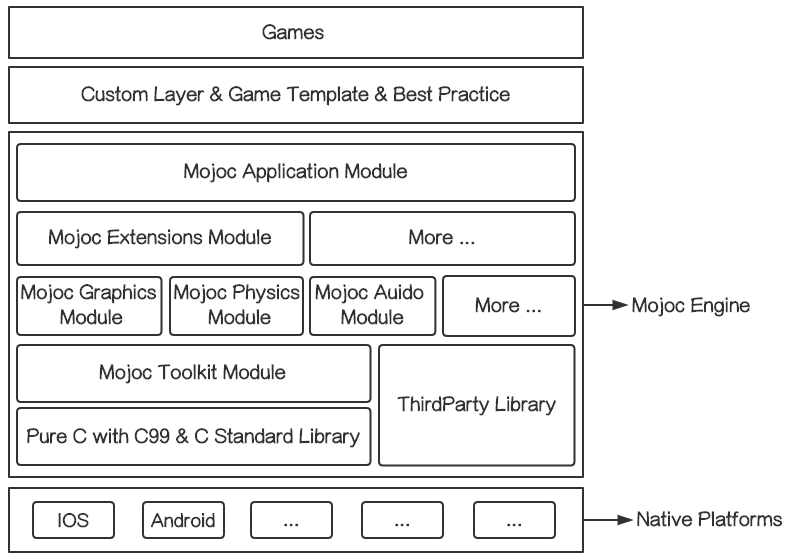

## 

Mojoc modules have a dependency hierarchy, the upper layer can reference the lower layer, but the lower layer cannot reference the upper layer, and parallel modules cannot reference each other. This ensures minimal dependency compilation of modules.

* [Toolkit Module](#toolkit-module)
* [ThirdParty Module](#thirdparty-module)
* [Graphics Module](#graphics-module)
* [Physics Module](#physics-module)
* [Audio Module](#audio-module)
* [Extension Module](#extension-module)
* [Application Module](#application-module)

## Toolkit Module

The [Toolkit](../Engine/Toolkit) module is a development kit for the C language. It provides basic data structure and algorithm support.

* [Math](../Engine/Toolkit/Math) provides mathematical algorithms implementation.
* [Utils](../Engine/Toolkit/Utils) provides basic data storage tools and algorithms.
* [HeaderUtils](../Engine/Toolkit/HeaderUtils) provides independent structure definitions or functions (with no `.c` file implementation).
* [Platform](../Engine/Toolkit/Platform) provides platform-related tools.

## ThirdParty Module

The [ThirdParty](../Engine/ThirdParty) module contains third party libraries, that can be directly called by the Mojoc engine. So the third party needs to provide different prebuilt lib files for native platforms supported by Mojoc.

* Currently only contains [PNG](../Engine/ThirdParty/PNG) library.
* [ThirdPartyBuild](../ThirdPartyBuild) is a multi-platform build project of the ThirdParty module.

## Graphics Module

[Graphics](../Engine/Graphics) module is draw layer implemented with OpenGLES3, and provides drawing tools and implementations.

* [Draw](../Engine/Graphics/Draw) provides basic abstract drawing layer.
* [OpenGL](../Engine/Graphics/OpenGL) provides OpenGLES rendering functions.
  * [Platform](../Engine/Graphics/OpenGL/Platform) provides platform-related EGL implementation.
* [Tween](../Engine/Graphics/Tween) provides tween animation implementation.
* [Utils](../Engine/Graphics/Utils) provides drawing support tools.

## Physics Module

[Physics](../Engine/Physics) module provides simple physical simulation.

## Audio Module

* [Audio.h](../Engine/Audio/Platform/Audio.h) is an interface for the audio API.
* [Platform](../Engine/Audio/Platform) is a cross-platform audio implementation.
  * [Android/Audio.c](../Engine/Audio/Platform/Android/Audio.c) is OpenSLES implementation in Android.
  * [IOS/Audio.m](../Engine/Audio/Platform/IOS/Audio.m) is OpenAL implementation in IOS.

## Extension Module

[Extension](../Engine/Extension) module contains editor-related implementations.
  * [Spine](../Engine/Extension/Spine) is runtime implementation of Spine 2D skeleton animation.

## Application Module

[Application](../Engine/Application) module contains the app control and interaction layer. It provides app lifecycle callbacks, input events, native platform functions, component architecture and so on.

* [Platform](../Engine/Application/Platform) contains platform-related implementations.
  * [Platform/Android](../Engine/Application/Platform/Android) contains native function implementations of Android.
  * [Platform/IOS](../Engine/Application/Platform/IOS) contains native function implementations of IOS.

## 
:book: