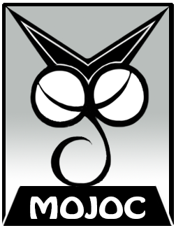

## Mojoc v0.7.1

Mojoc is an open-source, cross-platform, pure C game engine. It is based on OpenGLES3 and written in C99. It currently works on IOS and Android, but can easily be extended to other platforms, and will support more platforms in the future.

* Released versions in [releases](https://github.com/scottcgi/Mojoc/releases).
* Release changes in [ChangeLog](./ChangeLog.md).
* Documents in [Docs/Home](./Docs/Home.md).


## Architecture


## License
Mojoc is licensed under the [MIT License](./LICENSE "Mojoc Under MIT License").


## Core Idea
Less is more, simple is better, simplify complex ideas.


## Features

* The only programming skill needed is the C99 language.
* In platform-independent code, Mojoc uses only the standard C library, no dependence on third-party libraries.
* Mojoc has its own unique coding style.
  * [Mojoc Code Style](./Docs/CodeStyle.md)
* Mojoc uses an extremely lightweight OOC (Object Oriented C) programming model. 
  * [Mojoc OOC Model](./Docs/OOC.md)
* Mojoc application architecture is based on components, state-machines and message-driven. 
  * [Mojoc Component Architecture](./Docs/ComponentArchitecture.md)
* More feature details. 
  * [Mojoc Code Details](./Docs/CodeDetails.md)
  
    
## Published Games
Mojoc has been used for a cross-platform Android and IOS game. 

  
## Samples
The samples will show all aspects of the Mojoc features. Each platform will provide native building project for native platform editor. For example: Android provides AndroidStudio project, IOS provides XCode project.

Currently there is only one sample, which is a simplfied version of the published game [SuperLittleRed](./Samples/SuperLittleRed). Please check out the [Quick Start](./Docs/QuickStart.md) guide for how to quickly run this sample.

The compiled and playable apk is here:

* [SuperLittleRed-2.2.0.apk](./Samples/Apk/SuperLittleRed-2.2.0.apk?raw=true) is a bow and arrow shooting game, very challenging for your operation.


## FAQ

#### Why not C++?
  * There are plenty of C++ game engines, but pure C game engines are much rarer. I don't want to reinvent wheels, I hope to be different.
  * The core idea of the game engine I want to create is to be smaller and simple, which is consistent with the C language.
  * At the beginning, I had an idea of how to build a complex project with pure C language. I want to test the feasibility of the idea, that is Mojoc.
  * The C language is simple but powerful, it can do a lot of interesting things. **Why not C**?
    
#### What is the meaning of the name Mojoc? 
  ```
  Mojoc = Mojo + c
  ```
  The c stand for the C language.
    
#### Who designed the logo and what is its meaning?
  I designed it. The logo is an unknown creature made up of `"Mojoc"` letters.
  ```
  M : ears  
  OO: eyes  
  J : body  
  C : tail
  ```
  
#### How was Mojoc was born?

  Mojoc started in 2012 as a spare time project. At first, Mojoc used Eclipse + CDT + ADT + NDK for development, and was focused on Android platform. 
    
  During the development I experienced a lot of repetition and thinking. For a long time I was not very sure and clear about how to use the C language to simulate OOP and keep it simple and uniform. So I tried a lot of ideas, repeated the proces: wrote code, modified, refactored, changed ideas, deleted code, rewrote it again and so on.
  
  But in the end, I developed a unique rule set, the [Mojoc Code Style](./Docs/CodeStyle.md) and [Mojoc OOC Model](./Docs/OOC.md) that felt right and nice, then I followed the rules to develop Mojoc.


#### What kind of games can Mojoc do?

  For now, it is not recommended to use Mojoc to make games. To be honest, Mojoc is not yet quite perfect. There are many improvements and refinements left to be made, that I'm currently working on. But Mojoc's code architecture and programming model have already been established. 
  
  Therefore Mojoc is very suitable for learning and understanding of how to use the C language to build game engine.
  
  
## Roadmap
The roadmap shows the direction of Mojoc development.

#### Graphics Module
  * Create graphics layer compatible with Vulkan, Metal and D3D.
  * Create material system control shaders.
  * Support Primitive Restart and DrawInstance.
  * Support Sampler Objects and Immutable Textures.
  * Support dynamic Multi-Texture Unit rendering.
  
#### Extension Module
  * Support bitmap fonts.
  * Support simple unit tests for Mojoc features.
  
#### Physics Module
  * Support motion simulation after rigid body collision.
  * Support mutual restriction and linkage between rigid bodies.
  * Support more physical motion simulations.  
  
#### Toolkit Module  
  * Generic iteration interface, it's a step-by-step calculation that can be driven by coroutine.
  * Memory management strategy for many to one.
  * Plug-in function extensions.
  * More algorithm implementation.  
  
#### Other Modules  
  * Create UI module.
  * Create network module.
  
#### Others
  * Game editor implemented with Mojoc itself.
  * Game script language `"MojoScript"`, implemented with the C language and Toolkit module.  

## Support
  * Play Mojoc [Published Games](#published-games).
  * Star & Issue & Fork on GitHub, or share **Mojoc** project to anyone.
  * If the source code is **useful** or **helpful** for you, maybe buy me a coffee via **Sponsor Button**.
  
##  
:loop:
